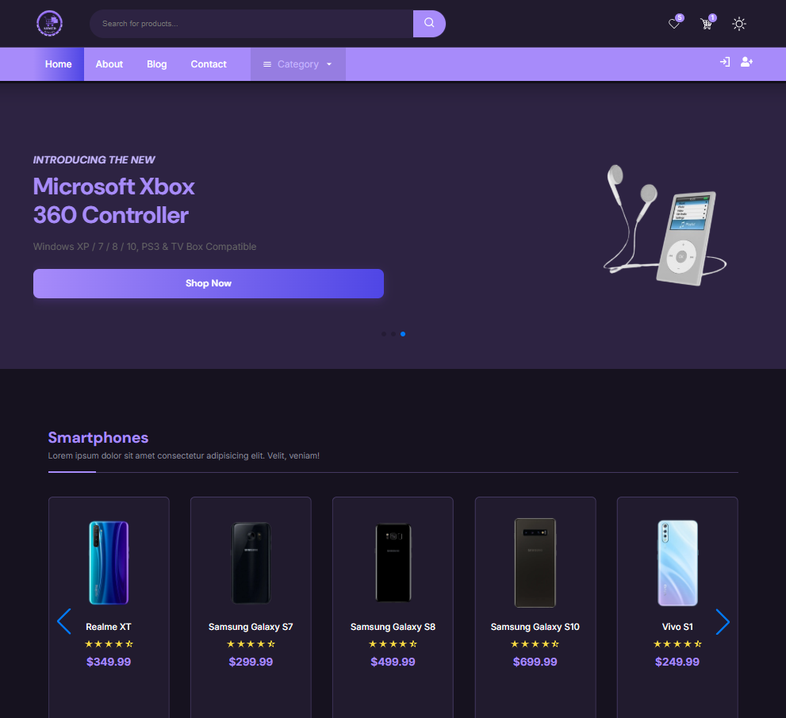
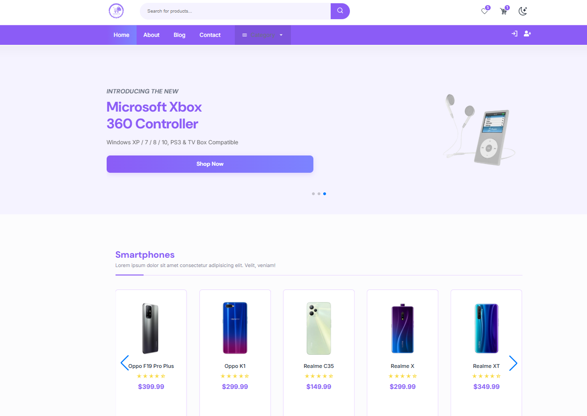
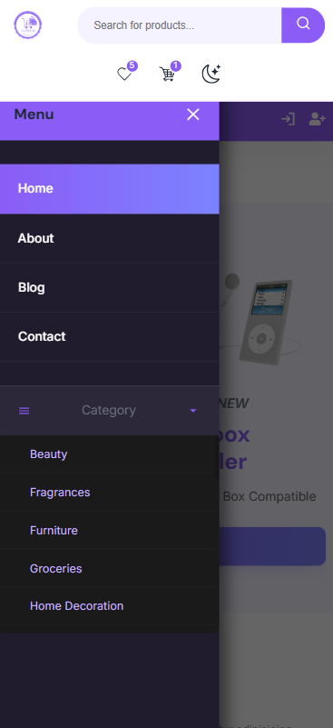
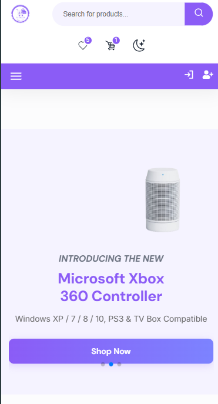
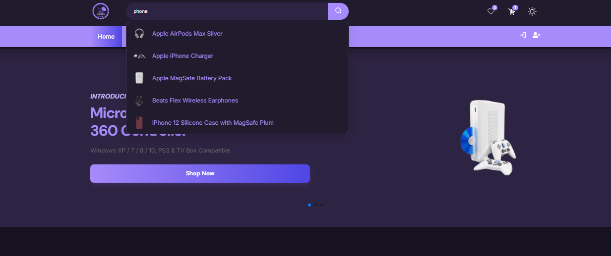
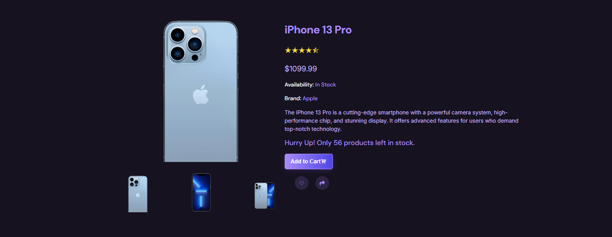
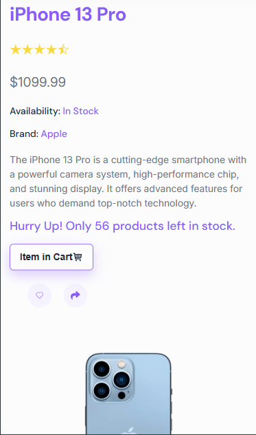
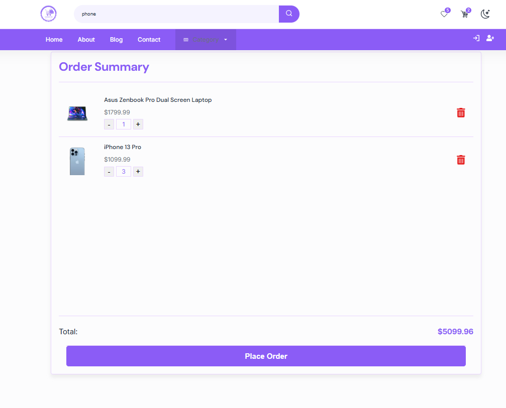
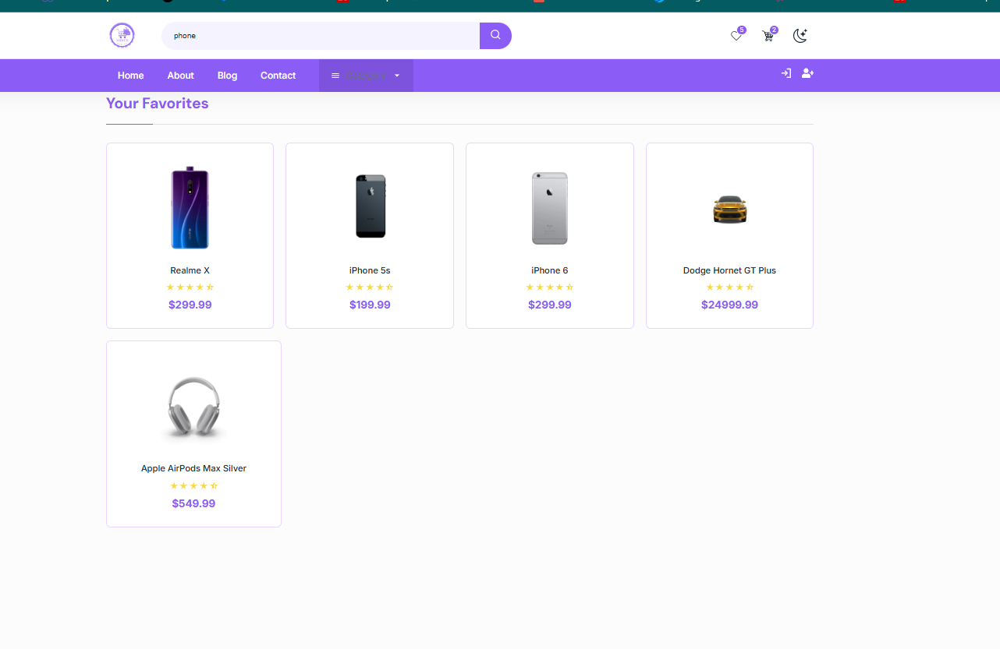

#  [🛒 E-Commerce React Store](https://ecommerce-react-mq7f.vercel.app/)

A modern, responsive e-commerce web application built with **React** and **Vite**. The application allows users to browse products, search with live suggestions, view product details, manage a shopping cart, save favorites, and switch between light and dark themes.

Designed with clean architecture, reusable components, and responsive layouts for desktop, tablet, and mobile devices.

 
 Live Demo [👉 Click here to view the live project](https://ecommerce-react-mq7f.vercel.app/)


<div align="center" style="margin: 25px 0; max-width: 800px; margin-left: auto; margin-right: auto;">

  <!-- Image 1 (Open by default) -->
  <details open style="margin-bottom: 15px; background: rgba(0, 105, 92, 0.05); padding: 12px; border-radius: 12px; border: 1px solid rgba(0, 105, 92, 0.15); text-align: left; direction: ltr;">
    <summary style="font-weight: bold; font-size: 16px; color: #00695c; cursor: pointer; user-select: none;">📸 (Click to Collapse)</summary>
    <div align="center">
      
    </div>
  </details>

  <!-- Image 2 -->
  <details style="margin-bottom: 15px; background: rgba(0, 105, 92, 0.05); padding: 12px; border-radius: 12px; border: 1px solid rgba(0, 105, 92, 0.15); text-align: left; direction: ltr;">
    <summary style="font-weight: bold; font-size: 16px; color: #00695c; cursor: pointer; user-select: none;">📸 (Click to Open)</summary>
    <div align="center">
      
    </div>
  </details>

  <!-- Image 2 -->
  <details style="margin-bottom: 15px; background: rgba(0, 105, 92, 0.05); padding: 12px; border-radius: 12px; border: 1px solid rgba(0, 105, 92, 0.15); text-align: left; direction: ltr;">
    <summary style="font-weight: bold; font-size: 16px; color: #00695c; cursor: pointer; user-select: none;">📸 (Click to Open)</summary>
    <div align="center">
      
    </div>
  </details>

  <!-- Image 2 -->
  <details style="margin-bottom: 15px; background: rgba(0, 105, 92, 0.05); padding: 12px; border-radius: 12px; border: 1px solid rgba(0, 105, 92, 0.15); text-align: left; direction: ltr;">
    <summary style="font-weight: bold; font-size: 16px; color: #00695c; cursor: pointer; user-select: none;">📸 (Click to Open)</summary>
    <div align="center">
      
    </div>
  </details>

  <!-- Image 2 -->
  <details style="margin-bottom: 15px; background: rgba(0, 105, 92, 0.05); padding: 12px; border-radius: 12px; border: 1px solid rgba(0, 105, 92, 0.15); text-align: left; direction: ltr;">
    <summary style="font-weight: bold; font-size: 16px; color: #00695c; cursor: pointer; user-select: none;">📸  (Click to Open)</summary>
    <div align="center">
      
    </div>
  <!-- Image 2 -->
  <details style="margin-bottom: 15px; background: rgba(0, 105, 92, 0.05); padding: 12px; border-radius: 12px; border: 1px solid rgba(0, 105, 92, 0.15); text-align: left; direction: ltr;">
    <summary style="font-weight: bold; font-size: 16px; color: #00695c; cursor: pointer; user-select: none;">📸  (Click to Open)</summary>
    <div align="center">
      
    </div>
  <!-- Image 2 -->
  <details style="margin-bottom: 15px; background: rgba(0, 105, 92, 0.05); padding: 12px; border-radius: 12px; border: 1px solid rgba(0, 105, 92, 0.15); text-align: left; direction: ltr;">
    <summary style="font-weight: bold; font-size: 16px; color: #00695c; cursor: pointer; user-select: none;">📸  (Click to Open)</summary>
    <div align="center">
      
    </div>
  <!-- Image 2 -->
  <details style="margin-bottom: 15px; background: rgba(0, 105, 92, 0.05); padding: 12px; border-radius: 12px; border: 1px solid rgba(0, 105, 92, 0.15); text-align: left; direction: ltr;">
    <summary style="font-weight: bold; font-size: 16px; color: #00695c; cursor: pointer; user-select: none;">📸  (Click to Open)</summary>
    <div align="center">
      
    </div>
  <!-- Image 2 -->
  <details style="margin-bottom: 15px; background: rgba(0, 105, 92, 0.05); padding: 12px; border-radius: 12px; border: 1px solid rgba(0, 105, 92, 0.15); text-align: left; direction: ltr;">
    <summary style="font-weight: bold; font-size: 16px; color: #00695c; cursor: pointer; user-select: none;">📸  (Click to Open)</summary>
    <div align="center">
      
    </div>
  </details>
  </div>


---

## ✨ Features

- 🛍️ Browse products by category
- 🔍 Live product search with suggestions
- 📄 Product details page
- ❤️ Favorites (Wishlist)
- 🛒 Shopping cart
- ➕ Increase & decrease product quantity
- 🌙 Light / Dark mode
- 💾 LocalStorage persistence
- 🎞️ Page transition animations
- 📱 Fully responsive design
- ⚡ Fast loading with skeleton loaders
- 🔥 Toast notifications
- 🎠 Hero slider using Swiper.js

---

## 🛠️ Built With

- React
- Vite
- React Router DOM
- Framer Motion
- Swiper.js
- React Icons
- React Hot Toast
- CSS3
- DummyJSON API

---

## 📁 Project Structure
```

ecommerce-react/
│
├── public/
│
├── src/
│
├── api/
│   ├── client.js
│   └── product.js
│
├── assets/
│   ├── images/
│   │   ├── logo.png
│   │   ├── hero1.png
│   │   ├── hero2.png
│   │   ├── hero3.png
│   │   └── ...
│   │
│   ├── icons/
│   └── fonts/
│
├── components/
│   │
│   ├── common/
│   │   ├── PageTransition.jsx
│   │   ├── ScrollToTop.jsx
│   │   ├── Button.jsx
│   │   ├── EmptyState.jsx
│   │   └── LoadingSpinner.jsx
│   │
│   ├── header/
│   │   ├── TopHeader.jsx
│   │   ├── BtmHeader.jsx
│   │   ├── SearchBox.jsx
│   │   └── header.css
│   │
│   ├── hero/
│   │   └── HeroSlider.jsx
│   │
│   ├── product/
│   │   ├── Product.jsx
│   │   ├── SlideProduct.jsx
│   │   ├── SlideProductLoading.jsx
│   │   ├── ProductCard.jsx
│   │   └── product.css
│   │
│   ├── footer/
│   │   ├── Footer.jsx
│   │   └── footer.css
│   │
│   └── ui/
│       ├── Badge.jsx
│       ├── Modal.jsx
│       ├── Breadcrumb.jsx
│       └── Skeleton.jsx
│
├── context/
│   ├── CartContext.jsx
│   └── ThemeContext.jsx
│
├── hooks/
│   ├── useDebounce.js
│   ├── useLocalStorage.js
│   └── useTheme.js
│
├── pages/
│   │
│   ├── Home/
│   │   ├── Home.jsx
│   │   └── home.css
│   │
│   ├── ProductDetails/
│   │   ├── ProductDetails.jsx
│   │   ├── ProductImages.jsx
│   │   ├── ProductInfo.jsx
│   │   ├── ProductDetailsLoading.jsx
│   │   └── productDetails.css
│   │
│   ├── Category/
│   │   ├── CategoryPage.jsx
│   │   └── categoryPage.css
│   │
│   ├── Search/
│   │   └── SearchResults.jsx
│   │
│   ├── Cart/
│   │   ├── Cart.jsx
│   │   └── cart.css
│   │
│   ├── Favorites/
│   │   ├── FavoritesPage.jsx
│   │   └── favorites.css
│   │
│   ├── About/
│   │   ├── About.jsx
│   │   └── about.css
│   │
│   ├── Blog/
│   │   ├── Blog.jsx
│   │   └── blog.css
│   │
│   ├── Contact/
│   │   ├── Contact.jsx
│   │   └── contact.css
│   │
│   └── Auth/
│       ├── SignIn.jsx
│       ├── Register.jsx
│       └── auth.css
│
├── styles/
│   ├── globals.css
│   ├── variables.css
│   ├── animations.css
│   ├── responsive.css
│   └── utilities.css
│
├── utils/
│   ├── formatPrice.js
│   ├── truncateText.js
│   └── helpers.js
│
├── App.jsx
├── main.jsx
└── vite-env.d.ts (if TypeScript)
│
├── .gitignore
├── package.json
├── README.md
└── vite.config.js
```

---


## 🔗 API

This project uses the **DummyJSON API**.

https://dummyjson.com/

---

## 📱 Responsive Design

The application is designed to work across:

- Mobile Phones
- Tablets
- Laptops
- Desktop Screens

---

## 📚 What I Learned

During this project I practiced and improved my skills in:

- React Hooks
- Component Architecture
- Context API
- React Router
- API Integration
- State Management
- Responsive Design
- Reusable Components
- Theme Switching
- Performance Optimization
- Project Refactoring
- Clean Code Organization

---

## 🔮 Future Improvements

- User Authentication
- Checkout Page
- Payment Integration
- Product Reviews
- Product Filtering
- Sorting Options
- Pagination
- Admin Dashboard
- Backend Integration
- Order History

---

## 👨‍💻 Author

**Ahmed Hegazy**

GitHub:
https://github.com/AhmedHegazy121

---

## ⭐ Support

If you like this project, consider giving it a ⭐ on GitHub.
